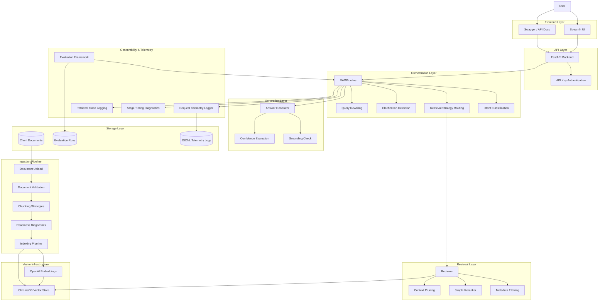

# CRC Governance-Aware RAG Platform — MVP V1 Architecture

## High-Level System Architecture

---

# System Flow Overview

## 1. Document Ingestion

Documents are uploaded through the Streamlit UI and passed through the ingestion pipeline.

The ingestion layer performs:

* document validation
* metadata extraction
* readiness diagnostics
* chunking strategy selection
* embedding generation
* vector indexing

Supported formats:

* TXT
* PDF
* DOCX

Supported chunking strategies:

* Character chunking
* Page chunking
* Heading-aware chunking
* Delimiter chunking

---

# 2. Retrieval Orchestration

The orchestration layer acts as the central intelligence layer of the system.

Responsibilities include:

* orchestration intent classification
* retrieval strategy routing
* conversational follow-up handling
* clarification detection
* query rewriting
* retrieval pruning
* telemetry integration

Supported orchestration intents:

* standard
* aggregation
* comparison
* clarification

Supported retrieval strategies:

* standard
* comparison
* document_balanced
* document-level retrieval

---

# 3. Retrieval Pipeline

The retrieval pipeline performs:

* semantic retrieval
* metadata filtering
* reranking
* retrieval pruning
* evidence packaging

Vector infrastructure:

* OpenAI embeddings
* ChromaDB persistent vector store

Retrieval controls:

* top_k
* min_score
* document filters
* metadata filters

---

# 4. Grounded Answer Generation

The generation layer creates grounded responses using retrieved evidence.

The system includes:

* grounding checks
* insufficient evidence handling
* confidence evaluation
* clarification handling

Supported answer states:

* ANSWERED
* INSUFFICIENT_EVIDENCE
* CLARIFICATION_REQUIRED
* NO_INDEX_FOUND

---

# 5. Observability & Telemetry

The platform includes extensive observability infrastructure.

Telemetry includes:

* orchestration reasoning
* retrieval strategy selection
* retrieval confidence
* grounding checks
* retrieval traces
* timing diagnostics
* request telemetry
* evaluation benchmarking

Telemetry persistence:

* JSONL request logs
* evaluation benchmark runs

---

# 6. Deployment Architecture

Deployment stack:

* FastAPI backend
* Streamlit frontend
* Docker Compose orchestration
* ChromaDB persistent storage

Authentication:

* API key authentication

API endpoints:

* `/ask`
* `/health`
* `/version`

---

# Engineering Focus Areas Demonstrated

This MVP demonstrates:

* retrieval engineering
* orchestration-aware AI systems
* conversational retrieval
* grounded answer generation
* observability and telemetry
* governance-aware AI workflows
* deployment architecture
* containerisation
* evaluation infrastructure
* operational AI engineering
