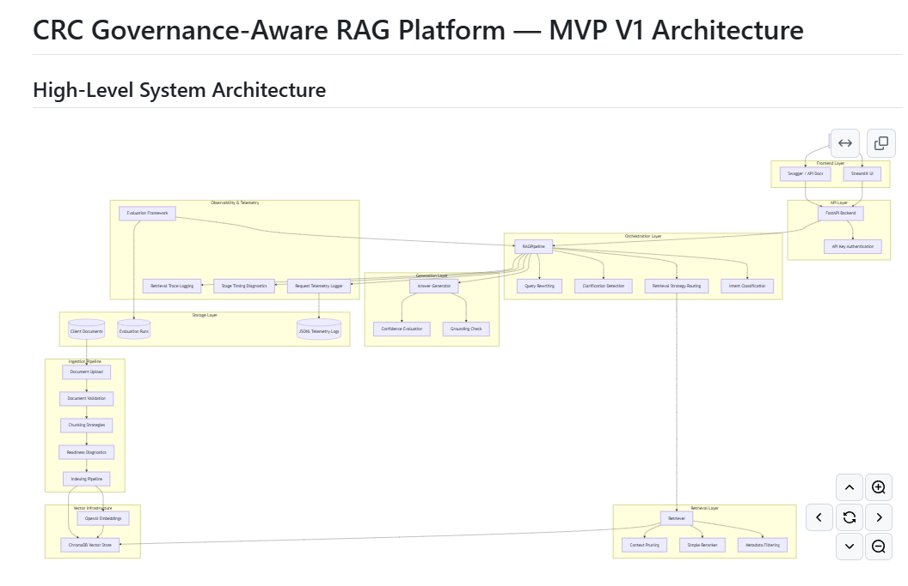

# CRC Governance-Aware RAG Platform

A governance-aware Retrieval Augmented Generation (RAG) platform focused on grounded retrieval, orchestration-aware reasoning, explainable AI behaviour, and operational observability.

This project forms part of the CRC AI Services roadmap and focuses on:

- trustworthy retrieval
- grounded responses
- orchestration-aware reasoning
- conversational retrieval
- retrieval observability
- governance-aware AI workflows
- ingestion diagnostics
- telemetry and evaluation
- operational knowledge-base workflows

---

# Current MVP Capabilities

## Document Ingestion

- TXT ingestion
- PDF ingestion
- DOCX ingestion
- ingestion diagnostics
- readiness scoring
- metadata extraction
- client-scoped indexing

## Chunking Strategies

- Character chunking
- Delimiter chunking
- Page chunking
- Heading-aware chunking

## Retrieval Features

- Semantic vector retrieval
- Metadata-scoped retrieval
- Retrieval confidence reporting
- Source tracing
- Retrieval pruning
- Document-scoped retrieval
- Aggregation-aware retrieval
- Comparison retrieval
- Unsupported-answer handling

## Orchestration Features

- Retrieval intent classification
- Conversational follow-up handling
- Clarification detection
- Query rewriting
- Adaptive retrieval routing
- Retrieval strategy selection

Supported orchestration intents:

- standard
- aggregation
- comparison
- clarification

Supported retrieval strategies:

- standard
- document_balanced
- comparison
- document-level retrieval

## Observability & Telemetry

- Retrieval telemetry
- Request telemetry logging
- Retrieval trace logging
- Pipeline timing diagnostics
- Stage timing diagnostics
- Orchestration reasoning visibility
- Retrieval score tracking
- Evaluation benchmarking

## API & Deployment

- FastAPI backend
- Docker Compose deployment
- API key authentication
- Structured error handling
- Streamlit UI frontend

Endpoints:

- `/ask`
- `/health`
- `/version`

---

# System Screenshots

## Streamlit UI — Standard Retrieval

Focused grounded retrieval using the `standard` orchestration intent and retrieval strategy.

---

## Streamlit UI — Aggregation Retrieval

Broad cross-document retrieval using the `aggregation` orchestration intent and `document_balanced` retrieval strategy.

---

## Swagger UI — Authenticated API Request

FastAPI Swagger interface demonstrating authenticated `/ask` endpoint usage.

---

## Telemetry & Observability Logging

Structured JSONL telemetry logging including:

- orchestration intent
- retrieval strategy
- timing diagnostics
- retrieval traces
- grounding checks
- retrieval confidence

## Architecture Diagram

# Current Status

Current state:

- Retrieval Evaluation V1 complete
- Orchestration layer operational
- Conversational retrieval operational
- Observability telemetry operational
- Docker deployment operational
- API authentication operational
- MVP V1 stabilisation complete

---

# Current MVP Limitations

Known limitations:

- global collection retrieval can introduce retrieval noise
- aggregation retrieval may retrieve semantically broad documents
- no hybrid lexical + semantic retrieval yet
- no advanced caching layer
- no multi-user permissions layer
- no enterprise authentication layer
- corpus/domain partitioning not yet implemented